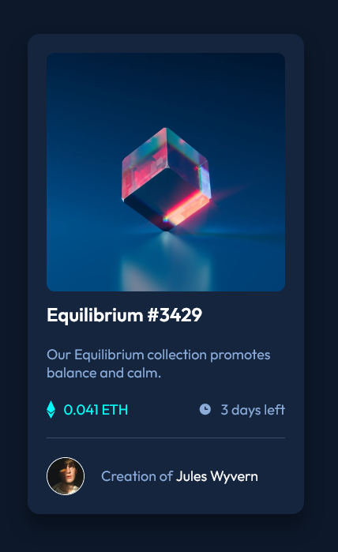

# Frontend Mentor - NFT preview card component solution

This is a solution to the [NFT preview card component challenge on Frontend Mentor](https://www.frontendmentor.io/challenges/nft-preview-card-component-SbdUL_w0U). Frontend Mentor challenges help you improve your coding skills by building realistic projects.

## Table of contents

- [Overview](#overview)
  - [The challenge](#the-challenge)
  - [Screenshot](#screenshot)
  - [Links](#links)
- [My process](#my-process)
  - [Built with](#built-with)
  - [What I learned](#what-i-learned)
  - [Continued development](#continued-development)
  - [Useful resources](#useful-resources)
- [Author](#author)
- [Acknowledgments](#acknowledgments)

**Note: Delete this note and update the table of contents based on what sections you keep.**

## Overview

### The challenge

Users should be able to:

- View the optimal layout depending on their device's screen size
- See hover states for interactive elements

### Screenshot



### Links

- Solution URL: [Add solution URL here](https://your-solution-url.com)
- Live Site URL: [Add live site URL here](https://your-live-site-url.com)

## My process

### Built with

- Semantic HTML5 markup
- CSS custom properties
- Flexbox
- CSS Grid

### What I learned

To write more organized CSS I used variables:
```css
:root {
  --primary-soft-blue: hsl(215, 51%, 70%);
  --primary-cyan: hsl(178, 100%, 50%);
  ...
}
```

To position overlay layer over the image the following code was used:
```css
.cover-image-overlay {
  background: rgba(0, 255, 247, 0.35);
  position: absolute;
  top: 50%;
  left: 50%;
  transform: translate(-50%, -50%);
  width: 100%;
  height: 100%;
``` 

To show overlay layer on image hover opacity was used:
```css
.img-container:hover .cover-image-overlay {
  opacity: 1;
  transition: 0.5s ease-in-out;
}
```

To align svg image with text margin: auto was used:
```css
.clock-icon {
  height: var(--pargraph-font-size);
  margin-top: auto;
  margin-bottom: auto;
  ...
}

```

### Continued development
This project will be developed in several phases:
1. Static page for desktop
2. On hover effects
3. Support for small and medium screens

Next improvement that will be done is to use SCSS to be more organized.

### Useful resources

- [w3 schools - Image Hover Overlay](https://www.w3schools.com/howto/howto_css_image_overlay.asp) - This helped me to create overlay effect to an image on hover.

## Author

- Website - [Karlo-Siladi.from.hr](http://karlo-siladi.from.hr)
- Linkedin - [Karlo Siladi](https://www.linkedin.com/in/karlosiladi/)
- Frontend Mentor - [@siladikarlo856](https://www.frontendmentor.io/profile/siladikarlo856)

## Acknowledgments
CSS tutorials - Kevin Powell Youtube [@kepowob](https://www.youtube.com/kepowob)
